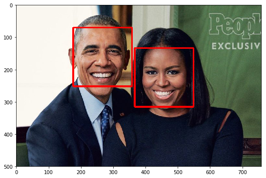
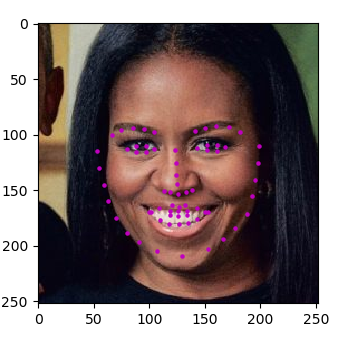
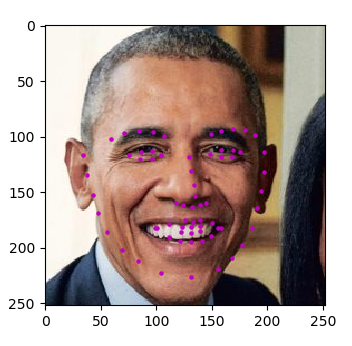

# Facial Landmark Detection

This project is about defining and training a convolutional neural network to perform facial keypoint detection, and using computer vision techniques to transform images of faces.
Facial keypoints include points around the eyes, nose, and mouth on a face and are used in many applications. These applications include: facial tracking,facial pose recognition, facial filters, and emotion recognition.

The code presented here should be able to look at any image, detect faces, and predict the locations of facial keypoints on each face. 

The process of landmark detection is split into two steps as shown below: 

1. An Image is fed to the first model (Haar cascade classifier) to detect the faces.

2. For each detected face, predict the facial keypoints position.

